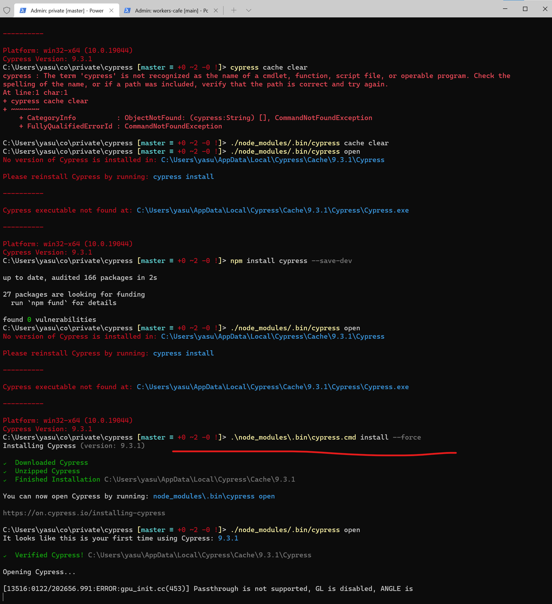

# Workers' Memo

## Cypress Installation

> Installation **<span style="color:red">Failed</span>** in GUIX OS, probably due to lack of dependencies 

In Windows 10, just following the standard instructions were not enough. The following had to be executed.
```powershell
.\node_modules\.bin\cypress.cmd install --force
```



